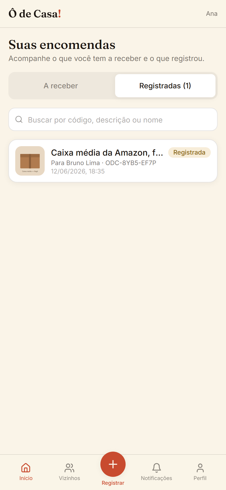

# Ô de Casa!

App mobile-first para vizinhos de confiança receberem encomendas uns dos outros.
O morador autoriza um vizinho; o vizinho registra a entrega com foto obrigatória;
o sistema gera um comprovante rastreável e notifica o destinatário, que dá baixa
na retirada.



## Stack

Next.js 15 (App Router) + TypeScript · Supabase (Auth/Postgres/Storage/Realtime) ·
Tailwind · Zod + React Hook Form · Playwright + Vitest.

## Rodando

```bash
npm install
npm run dev          # http://localhost:3000 (modo demo, dados no localStorage)
npm run test:unit    # Vitest — regras de negócio
npm run test:smoke   # Playwright — caminho-feliz + caminhos-tristes
npm run build        # build de produção
```

No modo demo, o botão "Entrar como demo" carrega usuários de exemplo (Ana, Bruno,
Carla) já vinculados — dá pra percorrer o fluxo inteiro sem cadastro. Em
**Perfil → Trocar de usuário** dá pra ver os dois lados (registrar como um,
receber e dar baixa como outro).

## Backend

A camada `src/lib/data` tem uma interface única com dois drivers, escolhidos por env:

- **`local`** (padrão): tudo no `localStorage`, sem backend.
- **`supabase`**: backend real com RLS. Para ativar:
  1. Crie um projeto no Supabase e rode `db/schema.sql` no SQL Editor.
  2. Habilite **Authentication → Providers → Anonymous sign-in**.
  3. Copie `.env.example` para `.env.local` e preencha
     `NEXT_PUBLIC_DATA_DRIVER=supabase`, URL e anon key.

## Documentação

- `SPEC.md` — requisitos funcionais (RF) e regras de negócio (BR) referenciadas no código.
- `SCREENS.md` — especificação das 8 telas com critérios de aceite.
- `DESIGN.md` — tokens visuais (cores, tipografia, layout).
- `db/schema.sql` — schema Postgres + RLS + seed.

## Deploy (Vercel)

1. Suba o repo no GitHub (o CI em `.github/workflows/ci.yml` roda build + testes).
2. Importe o repo na Vercel (framework: Next.js, sem config extra).
3. Defina as envs do `.env.example` no painel da Vercel.

Observabilidade: defina `NEXT_PUBLIC_SENTRY_DSN` para ativar o Sentry. Sem a env,
fica inerte.
